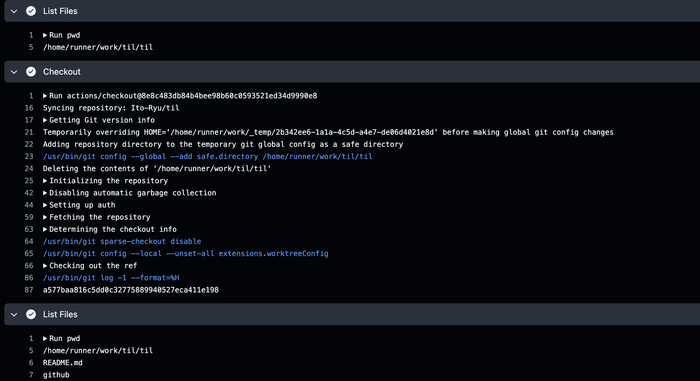

# Github Actions 実行場所
Github Actions の実行ファイルは、`.github/workflow/xxx.yaml` のディレクトリに存在するが、実行する場所は、git リポジトリのルートディレクトリである。

## 実際に確認してみる
### `.github/workflow/xxx.yaml` に `pwd` コマンドを入れる
``` yaml
# pwd.yaml
name: pwd
on:
  pull_request:
    types: [opened, reopened, synchronize, ready_for_review]
    branches:
      - main

jobs:
  plan:
    runs-on: ubuntu-latest
    steps:
      - name: List Files
        run: |
          pwd
          ls

      - name: Checkout
        uses: actions/checkout@8e8c483db84b4bee98b60c0593521ed34d9990e8 # v6.0.1

      - name: List Files
        run: |
          pwd
          ls
```
### 実行結果
* いい感じかも
